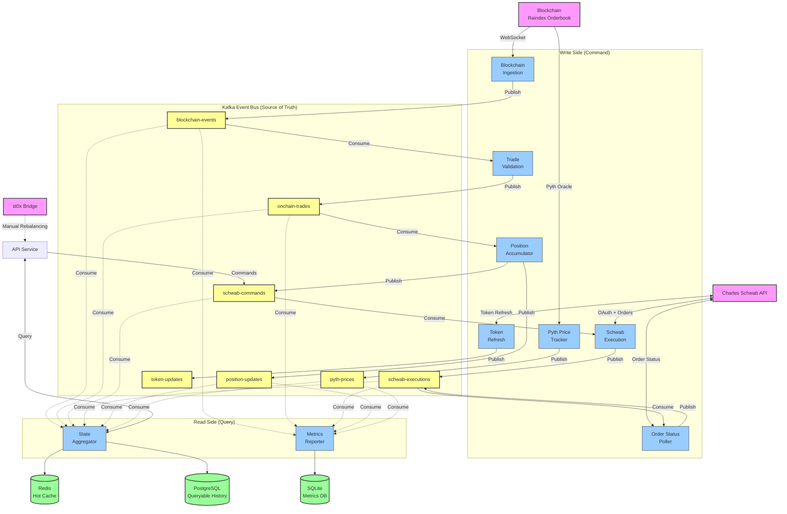
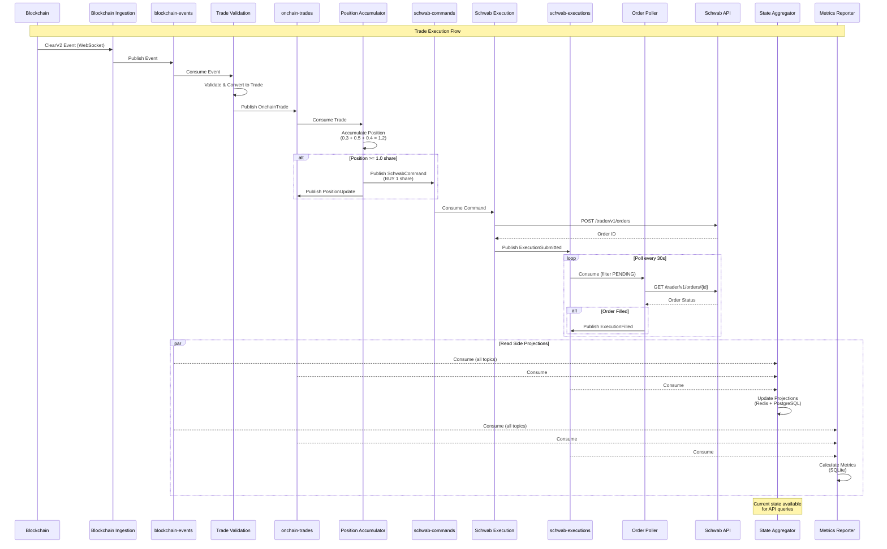

# **Arbitrage Bot Specification for Tokenized Equities (V1 MVP)**

## **Background**

Early-stage onchain tokenized equity markets typically suffer from poor price
discovery and limited liquidity. Without sufficient market makers, onchain
prices can diverge substantially from traditional equity market prices, creating
a poor user experience and limiting adoption.

## **Solution Overview**

This specification outlines a minimum viable product (MVP) arbitrage bot that
helps establish price discovery by exploiting discrepancies between onchain
tokenized equities and their traditional market counterparts.

The bot monitors Raindex Orders from a specific owner that continuously offer
tokenized equities at spreads around Pyth oracle prices. When a solver clears
any of these orders, the bot immediately executes an offsetting trade on Charles
Schwab, maintaining market-neutral positions while capturing the spread
differential.

The focus is on getting a functional system live quickly. There are known risks
that will be addressed in future iterations as total value locked (TVL) grows
and the system proves market fit.

## **Operational Process and Architecture**

### **System Components**

**Onchain Infrastructure:**

- Raindex orderbook with deployed Orders from specific owner using Pyth oracle
  feeds
  - Multiple orders continuously offer to buy/sell different tokenized equities
    at Pyth price ± spread
- Order vaults holding stablecoins and tokenized equities
- Pyth oracle price feeds for real-time equity prices

**Event Store (Kafka):**

- Central event bus and source of truth for all system events
- Kafka topics:
  - `blockchain-events`: Raw blockchain events (ClearV2, TakeOrderV2)
  - `onchain-trades`: Validated onchain trade events
  - `schwab-commands`: Commands to execute Schwab orders
  - `schwab-executions`: Schwab execution results and status updates
  - `position-updates`: Position accumulation and threshold events
  - `pyth-prices`: Onchain Pyth oracle price updates
  - `token-updates`: OAuth token refresh events
- Event immutability ensures complete audit trail
- Enables event replay and time-travel queries

**Microservices Architecture:**

The system consists of independent services communicating via Kafka:

1. **Blockchain Ingestion Service**
   - Monitors blockchain via WebSocket for ClearV2 and TakeOrderV2 events
   - Handles backfilling from historical blocks and live event streaming
   - Publishes raw events to `blockchain-events` topic
   - Ensures no events are missed during restarts

2. **Trade Validation Service**
   - Consumes from `blockchain-events` topic
   - Validates events against configured order owner
   - Converts valid events to structured OnchainTrade records
   - Publishes validated trades to `onchain-trades` topic
   - Filters out events not relevant to arbitrage operations

3. **Position Accumulator Service**
   - Consumes from `onchain-trades` topic
   - Maintains running position accumulators per symbol
   - Accumulates fractional shares until whole share threshold (≥1.0) is reached
   - Publishes execution commands to `schwab-commands` when threshold reached
   - Publishes position updates to `position-updates` for tracking
   - Handles both long (buy) and short (sell) position accumulation

4. **Schwab Execution Service**
   - Consumes from `schwab-commands` topic
   - Executes market orders via Charles Schwab API
   - Handles OAuth authentication and token management
   - Publishes execution results to `schwab-executions` topic
   - Implements retry logic with exponential backoff for transient failures

5. **Order Status Polling Service**
   - Periodically polls Schwab API for pending order status
   - Publishes status updates to `schwab-executions` topic
   - Handles order fills, partial fills, and failures
   - Implements jittered polling intervals to avoid rate limits

6. **Token Refresh Service**
   - Manages Charles Schwab OAuth token lifecycle
   - Automatically refreshes access tokens before expiration
   - Publishes token updates to `token-updates` topic
   - Alerts on refresh token expiration requiring manual re-authentication

7. **Pyth Price Tracker Service**
   - Monitors onchain Pyth oracle price feeds
   - Tracks price updates for tokenized equity symbols
   - Publishes price data to `pyth-prices` topic
   - Enables correlation analysis between oracle prices and executed trades

8. **State Aggregator Service (Query Side)**
   - Consumes from all event topics to build current state projections
   - Maintains fast-access materialized views (Redis or PostgreSQL)
   - Provides read-optimized queries for:
     - Current positions across both venues
     - Pending executions and their status
     - Recent trade history
     - Position accumulator states per symbol
   - Serves API queries without touching the event store
   - Can rebuild state by replaying events from Kafka

9. **Metrics Reporter Service**
   - Consumes from all event topics
   - Writes aggregated metrics to SQLite database
   - Provides historical analytics and reporting
   - Database is read-only for external reporting tools
   - Independent from operational services (no other service reads this DB)

10. **API Service**
    - Provides REST API for external access
    - Queries State Aggregator for current system state
    - Publishes commands to Kafka for manual operations
    - Handles authentication endpoints for Charles Schwab OAuth flow
    - Exposes health checks and monitoring endpoints

**Data Storage:**

- **Kafka (Event Store)**: Source of truth for all events, permanent retention
- **SQLite (Metrics Database)**: Read-only analytics database for reporting
- **Redis/PostgreSQL (State Database)**: Fast materialized views for current
  state queries
- **Charles Schwab Account**: External brokerage account with API access

**Bridge Infrastructure:**

- st0x bridge for offchain ↔ onchain asset movement and rebalancing

### **Architecture Diagrams**

**System Architecture Overview:**



**Event Flow Through System:**



### **Operational Flow**

The system operates as an event-driven pipeline where each service processes
events independently through Kafka topics. Events flow through the system as
immutable facts, enabling complete auditability and replay capabilities.

**Normal Operation Cycle:**

1. **Event Ingestion**
   - Orders continuously offer to buy/sell tokenized equities at Pyth price ±
     spread on Raindex
   - Blockchain Ingestion Service monitors for ClearV2 and TakeOrderV2 events
     via WebSocket
   - Events are published to `blockchain-events` topic with full event data and
     metadata
   - Service handles both historical backfilling and live event streaming

2. **Event Validation and Trade Conversion**
   - Trade Validation Service consumes from `blockchain-events`
   - Filters events to only process those involving the configured order owner
     address
   - Validates event structure and extracts trade details (symbol, amount,
     direction, price)
   - Publishes validated OnchainTrade events to `onchain-trades` topic
   - Non-matching events are filtered out without downstream processing

3. **Position Accumulation**
   - Position Accumulator Service consumes from `onchain-trades`
   - Maintains running position accumulator per symbol
   - Accumulates fractional shares until whole share threshold (≥1.0) is reached
   - When threshold reached:
     - Calculates execution amount: floor(abs(net_position)) shares
     - Determines direction: positive position → SELL, negative position → BUY
     - Publishes SchwabCommand to `schwab-commands` topic
     - Publishes PositionUpdate to `position-updates` topic
   - Continues tracking remaining fractional position after execution trigger

4. **Schwab Execution**
   - Schwab Execution Service consumes from `schwab-commands`
   - Executes market orders via Charles Schwab API
   - Publishes execution results to `schwab-executions` topic:
     - SUBMITTED: Order sent to Schwab, order ID received
     - FILLED: Order completed, final price received
     - FAILED: Order failed, error details included
   - Implements retry logic for transient API failures

5. **Order Status Tracking**
   - Order Status Polling Service periodically queries Schwab API for pending
     orders
   - Publishes status updates to `schwab-executions` topic as orders progress
   - Handles partial fills, complete fills, and order failures
   - Uses jittered polling intervals to respect API rate limits

6. **State Aggregation**
   - State Aggregator Service consumes from all topics
   - Builds real-time projections of:
     - Current positions across both venues (onchain + Schwab)
     - Pending executions and their status
     - Position accumulator states per symbol
   - Serves fast queries via API without touching event store

7. **Metrics and Reporting**
   - Metrics Reporter Service consumes from all topics
   - Calculates P&L, execution statistics, and performance metrics
   - Writes aggregated data to SQLite database for historical analysis
   - Provides data for external reporting and visualization tools

**Example Flow (Offchain Batching):**

Onchain events:

- Event 1: 0.3 AAPL sold → Position: -0.3
- Event 2: 0.5 AAPL sold → Position: -0.8
- Event 3: 0.4 AAPL sold → Position: -1.2 (threshold reached!)

Position Accumulator:

- Publishes SchwabCommand: BUY 1 AAPL (floor of 1.2)
- Continues tracking: -0.2 AAPL net position
- Waits for more events to accumulate next whole share

Schwab Execution:

- Executes BUY 1 AAPL via API
- Publishes result to `schwab-executions`

State Aggregator:

- Updates current position: Schwab +1 AAPL, Onchain -1.2 AAPL, Net: -0.2 AAPL

**Event Replay and Recovery:**

- Any service can rebuild its state by replaying events from Kafka
- System automatically recovers from failures by resuming from last processed
  offset
- Historical state can be queried by replaying events up to a specific point in
  time
- Complete audit trail maintained in event store

**Rebalancing Process (Manual for now):**

- State Aggregator provides current inventory positions across both venues
- Monitor inventory drift over time via metrics dashboard
- Execute st0x bridge transfers to rebalance equity positions on/offchain
- Move stablecoins/USD as needed to maintain adequate trading capital
- Maintain sufficient offchain equity positions to match potential onchain sales
  and vice versa

## **System Architecture Specification**

The system is built as a distributed microservices architecture using Rust for
performance, safety, and excellent async capabilities. Services communicate via
Kafka event streams following Event Sourcing and CQRS patterns.

### **Event Sourcing and CQRS Architecture**

**Event Sourcing Principles:**

- All state changes are captured as immutable events in Kafka topics
- Events are the source of truth - all other state is derived
- Events are never deleted or modified, only appended
- Complete audit trail of all system operations
- Ability to rebuild any state by replaying events
- Time-travel queries: reconstruct system state at any historical point

**CQRS (Command Query Responsibility Segregation):**

- **Write Model (Command Side):**
  - Services process commands and publish events to Kafka
  - Examples: Trade Validation Service, Position Accumulator Service
  - Focus on business logic and state transitions
- **Read Model (Query Side):**
  - State Aggregator Service builds optimized projections
  - Materialized views in Redis/PostgreSQL for fast queries
  - API Service queries read models without touching event store
  - Can have multiple read models optimized for different queries

**Benefits of ES/CQRS:**

- Scalability: Write and read models scale independently
- Resilience: Services can be rebuilt from event stream
- Flexibility: New projections added without changing write model
- Auditability: Complete history of all state changes
- Debugging: Replay events to reproduce any system state

### **Kafka Event Bus**

**Topic Design:**

- **blockchain-events**: Raw blockchain events (ClearV2, TakeOrderV2)
  - Key: `{tx_hash}:{log_index}`
  - Partition by: order owner address for ordered processing
  - Retention: Permanent (compacted log)
- **onchain-trades**: Validated trade events
  - Key: `{symbol}:{tx_hash}:{log_index}`
  - Partition by: symbol for parallel processing per asset
  - Retention: Permanent
- **schwab-commands**: Execution commands
  - Key: `{symbol}:{execution_id}`
  - Partition by: symbol for ordered execution per asset
  - Retention: 7 days
- **schwab-executions**: Execution status updates
  - Key: `{execution_id}`
  - Partition by: execution_id
  - Retention: Permanent
- **position-updates**: Position accumulation events
  - Key: `{symbol}`
  - Partition by: symbol
  - Retention: Permanent (compacted log)
- **pyth-prices**: Oracle price updates
  - Key: `{symbol}`
  - Partition by: symbol
  - Retention: 30 days
- **token-updates**: OAuth token refresh events
  - Key: `singleton`
  - Single partition
  - Retention: 7 days

**Consumer Groups:**

- Each service has its own consumer group
- Enables independent consumption rates and offset management
- Services can be restarted and resume from last committed offset

**Idempotency and Exactly-Once Semantics:**

- Kafka transactions for exactly-once event processing
- Event deduplication at service level using event keys
- Idempotent event handlers (processing same event multiple times = same result)

### **Service Implementation Details**

**1. Blockchain Ingestion Service**

- Rust with Alloy library for Ethereum interactions
- WebSocket connection to Ethereum node
- Backfilling logic:
  - Queries last processed block from Kafka
  - Fetches historical events via `eth_getLogs`
  - Publishes to `blockchain-events` with ordering guarantees
- Live event streaming:
  - Subscribes to ClearV2 and TakeOrderV2 event filters
  - Handles WebSocket reconnections with exponential backoff
  - Deduplicates events using `(tx_hash, log_index)` keys
- Graceful shutdown: Completes in-flight event publishing before exit

**2. Trade Validation Service**

- Consumes from `blockchain-events` with order guarantees
- Validation logic:
  - Checks event owner against configured arbitrageur address
  - Validates token pair (USDC + tokenized equity with "0x" suffix)
  - Extracts symbol, amount, direction, price from event data
- Publishes validated trades to `onchain-trades`
- Filtered events are logged but not published downstream
- State management:
  - Symbol cache for token address → symbol lookups
  - No persistent state required (stateless service)

**3. Position Accumulator Service**

- Consumes from `onchain-trades` partitioned by symbol
- Maintains in-memory position accumulators per symbol
- State persistence:
  - Periodically snapshots state to Kafka compacted topic
  - Rebuilds from snapshot + subsequent events on startup
- Threshold logic:
  - Accumulates fractional positions until abs(position) ≥ 1.0
  - Calculates execution: `shares = floor(abs(position))`
  - Direction: `position > 0 → SELL, position < 0 → BUY`
  - Remaining: `position - (sign(position) * shares)`
- Publishes:
  - SchwabCommand to `schwab-commands` when threshold reached
  - PositionUpdate to `position-updates` for every trade
- Concurrency: Per-symbol partition ensures ordered processing

**4. Schwab Execution Service**

- Consumes from `schwab-commands` partitioned by symbol
- Charles Schwab API integration:
  - OAuth 2.0 authentication with automatic token refresh
  - Connection pooling with reqwest HTTP client
  - Rate limiting: tracks API call quotas
  - Retry logic: exponential backoff for transient failures
- Execution flow:
  - Receives SchwabCommand from Kafka
  - Places market order via POST `/trader/v1/orders`
  - Publishes ExecutionSubmitted to `schwab-executions` with order ID
  - On API error, publishes ExecutionFailed with error details
- Idempotency: Command deduplication by execution_id
- No persistent state (stateless service)

**5. Order Status Polling Service**

- Maintains list of pending order IDs from `schwab-executions` topic
- Polling strategy:
  - Base interval: 30 seconds
  - Jitter: ±10 seconds to avoid thundering herd
  - Exponential backoff on API errors
- Status updates:
  - Queries GET `/trader/v1/orders/{orderId}`
  - Detects state transitions: PENDING → FILLED or FAILED
  - Publishes ExecutionFilled or ExecutionFailed to `schwab-executions`
- Cleanup: Removes completed orders from polling list
- State management: In-memory set of pending order IDs, rebuilt from Kafka on
  startup

**6. Token Refresh Service**

- Manages OAuth token lifecycle for Schwab API
- Token storage: Reads/writes tokens to `token-updates` Kafka topic (encrypted)
- Refresh logic:
  - Checks token expiry every 5 minutes
  - Refreshes access token 5 minutes before expiration
  - Uses refresh token to obtain new access token
  - Publishes TokenRefreshed event with new tokens
- Failure handling:
  - On refresh token expiry, publishes TokenExpired alert
  - Requires manual re-authentication via API
- All services consume from `token-updates` to get current tokens

**7. Pyth Price Tracker Service**

- Monitors Pyth oracle contracts for price updates
- WebSocket connection to blockchain for PriceFeedUpdate events
- Publishes price data to `pyth-prices` topic:
  - Symbol, price, timestamp, confidence interval
- Enables correlation analysis between oracle prices and trade execution
- No persistent state (stateless service)

**8. State Aggregator Service**

- Consumes from all event topics to build current state
- Maintains projections in Redis/PostgreSQL:
  - Current positions per symbol (onchain + Schwab)
  - Pending executions and their status
  - Position accumulators per symbol
  - Recent trade history
- Query API (REST):
  - GET `/positions`: Current positions across venues
  - GET `/positions/{symbol}`: Position for specific symbol
  - GET `/executions`: Recent executions
  - GET `/accumulators`: Position accumulator states
- Rebuild capability:
  - Can drop all state and rebuild from Kafka events
  - Useful for schema migrations or corruption recovery
- Caching strategy: Redis for hot data, PostgreSQL for queryable history

**9. Metrics Reporter Service**

- Consumes from all event topics
- Calculates metrics:
  - P&L per trade and cumulative
  - Execution latency (onchain event → Schwab fill)
  - Position drift over time
  - API success/failure rates
  - Throughput and processing rates
- Writes to SQLite database for reporting
- Database schema optimized for analytics queries
- No other services read from this database
- Export capabilities: CSV, JSON, Prometheus metrics

**10. API Service**

- REST API built with Rocket framework
- Endpoints:
  - `/health`: System health check
  - `/auth/login`: Initiate Schwab OAuth flow
  - `/auth/callback`: OAuth callback handler
  - `/positions`: Query current positions
  - `/trades`: Query trade history
  - `/executions`: Query execution history
  - `/metrics`: System metrics
- Queries State Aggregator service for all data
- Manual operations: Publish commands to Kafka for manual trades
- Authentication: JWT tokens for API access

### **Idempotency and Reliability**

**Idempotent Event Processing:**

- All event handlers are idempotent - processing same event multiple times
  produces same result
- Event deduplication using event keys before processing
- Database operations use INSERT OR IGNORE for idempotency

**Failure Handling:**

- Service failures: Kafka consumer group rebalances work to healthy instances
- Message processing failures: Dead letter queue for failed events
- Retry logic: Exponential backoff with max attempts before DLQ
- Graceful shutdown: Complete in-flight work before terminating

**Exactly-Once Processing:**

- Kafka transactions ensure events are processed exactly once
- Consumer offsets committed only after successful processing
- State updates and event publishing in single transaction where possible

### **Trade Tracking and Reporting**

The system uses a multi-tiered approach to data storage and querying, separating
the event store (source of truth) from read-optimized projections.

**Kafka Event Store (Source of Truth):**

- All events permanently stored in Kafka topics
- Events are immutable and form complete audit trail
- Topics:
  - `blockchain-events`: Raw blockchain events
  - `onchain-trades`: Validated trade events
  - `schwab-executions`: Execution results and status updates
  - `position-updates`: Position changes and accumulations
  - `pyth-prices`: Oracle price data
- Retention policies ensure critical events never expire
- Event replay capability for rebuilding any state

**State Aggregator Projections (Fast Queries):**

- Redis for real-time hot data:
  - Current positions per symbol
  - Pending executions
  - Active position accumulators
  - Recent trade summaries
  - TTL-based expiration for automatic cleanup
- PostgreSQL for queryable history:
  - All trades with full metadata
  - Execution history with timestamps
  - Position history over time
  - Indexed for fast queries on symbol, timestamp, status
- Materialized views updated in real-time as events arrive
- Can be completely rebuilt from Kafka events if corrupted

**Metrics Reporter Database (Analytics):**

The Metrics Reporter Service maintains a SQLite database optimized for reporting
and analytics. This database is a read-only projection for external tools and
does not participate in operational decision-making.

Tables:

- **trades**: Denormalized trade records with all metadata
  - Onchain trade details (symbol, amount, direction, price)
  - Linked Schwab execution details
  - Timestamps for latency analysis
  - P&L calculations
- **executions**: Schwab execution tracking
  - Execution status transitions (PENDING → SUBMITTED → FILLED/FAILED)
  - Order IDs and fill prices
  - Retry counts and failure reasons
- **positions**: Snapshot of positions over time
  - Periodic snapshots (e.g., hourly) of net positions
  - Per-symbol positions across venues
  - Position drift metrics
- **performance_metrics**: Aggregated performance data
  - Daily/weekly/monthly P&L summaries
  - Average execution latency
  - Success/failure rates
  - Trading volume statistics

**Pyth Price Extraction:**

- Extracts exact oracle prices used during trade execution from transaction
  traces
- Uses `debug_traceTransaction` RPC method to analyze transaction execution
- Parses Pyth oracle contract calls to retrieve precise price data including
  price value, confidence interval, exponent, and publish timestamp
- Prices are stored in the `onchain_trades` table alongside trade records
- NULL price values indicate extraction failed (e.g., no Pyth call in trace, RPC
  errors)
- CLI command for testing: `cargo run --bin cli get-pyth-price <TX_HASH>`
- Trade processing continues normally even if price extraction fails

**Reporting and Analysis:**

- Calculate profit/loss for each trade pair using actual executed amounts
- Generate running totals and performance reports over time
- Track inventory positions across both venues (onchain vs. Schwab)
- Execution latency analysis (blockchain event → Schwab fill time)
- Identify unprofitable trades for strategy optimization
- Export capabilities:
  - CSV export for spreadsheet analysis
  - JSON API for custom dashboards
  - Prometheus metrics for Grafana integration
- Historical queries: Query system state at any point in time by replaying
  events
- Correlation analysis: Compare Pyth oracle prices with execution prices

**Audit Trail:**

- Complete event stream in Kafka provides immutable audit trail
- Every state change traceable to specific event(s)
- Replay events to reproduce any historical system state
- Compliance reporting: Full history of all trades and executions

### **Health Monitoring and Logging**

**Service Health Checks:**

- Each service exposes `/health` endpoint for liveness/readiness probes
- Health check includes:
  - Service uptime
  - Kafka connection status
  - Consumer lag (events pending processing)
  - Recent error rates
  - Resource utilization (CPU, memory)
- Orchestration platform (Docker/Kubernetes) monitors health endpoints
- Automatic restart of unhealthy services

**Structured Logging:**

- All services use structured logging (JSON format)
- Log levels: TRACE, DEBUG, INFO, WARN, ERROR
- Contextual information in every log entry:
  - Service name
  - Event ID (tx_hash, log_index for traceability)
  - Timestamp with microsecond precision
  - Trace ID for distributed tracing
- Centralized log aggregation:
  - Logs shipped to centralized system (e.g., ELK stack, Loki)
  - Queryable across all services
  - Correlation by trace ID or event ID

**Distributed Tracing:**

- OpenTelemetry instrumentation for distributed traces
- Traces follow events through entire pipeline:
  - Blockchain event → Trade validation → Position accumulation → Schwab
    execution → Status update
- Trace visualization in Jaeger or Zipkin
- Latency breakdown by service
- Identifies bottlenecks in event processing pipeline

**Metrics Collection:**

- Prometheus metrics exposed by each service:
  - **Counters**: Events processed, API calls, errors
  - **Gauges**: Current positions, pending executions, consumer lag
  - **Histograms**: Processing latency, API response time
  - **Summaries**: P&L, execution success rate
- Metrics scraped by Prometheus server
- Grafana dashboards for visualization:
  - System overview dashboard
  - Per-service dashboards
  - Trading performance dashboard
  - Kafka lag and throughput dashboard

**Kafka Monitoring:**

- Consumer lag tracking per service
  - Alerts when lag exceeds threshold (e.g., >100 events)
  - Indicates slow consumer or processing bottleneck
- Topic metrics:
  - Messages per second
  - Partition distribution
  - Disk usage
  - Replication status
- Kafka Manager or Confluent Control Center for operational monitoring

**Alerting:**

- Alert rules defined in Prometheus/Grafana:
  - Service down (health check failure)
  - High consumer lag (processing delay)
  - API errors above threshold
  - Token refresh failures
  - Position drift exceeds limits
  - Schwab execution failures
- Alert channels:
  - PagerDuty for critical alerts
  - Slack for warnings
  - Email for daily summaries
- Alert severity levels: CRITICAL, WARNING, INFO

**Position Drift Monitoring:**

- State Aggregator tracks net position across venues
- Alerts triggered when drift exceeds threshold:
  - Per-symbol drift: Net position ≠ 0 beyond tolerance
  - Total portfolio drift: Cumulative exposure too high
- Dashboard shows real-time position drift per symbol
- Triggers manual rebalancing via st0x bridge

**Error Tracking and Debugging:**

- Custom error types per service with context
- Error aggregation and grouping (e.g., Sentry)
- Stack traces with source maps
- Error rate tracking and anomaly detection
- Failed event routing to dead letter queue for manual inspection

**Configuration Management:**

- Environment variables for deployment-specific config
- Config files for static configuration
- Secrets management: Kubernetes secrets or Vault for sensitive data
- Configuration validation on service startup
- Hot reload capability for non-critical config changes

### **Risk Management**

**Manual Intervention:**

- API endpoints for manual operations with proper authentication
- Emergency stop mechanism: Pause event consumption without losing state
- Manual trade execution: Publish commands directly to `schwab-commands` topic
- Position reconciliation: Compare actual vs. expected positions across venues

**Graceful Shutdown:**

- Services complete in-flight work before terminating
- Kafka consumer offsets committed only after successful processing
- No events lost during shutdown and restart
- Coordinated shutdown: API rejects new requests, services drain queues

**Circuit Breakers:**

- Schwab API circuit breaker: Stop executions if error rate too high
- Automatic recovery when error rate drops below threshold
- Manual override to force enable/disable circuit breaker

**Rate Limiting:**

- Respect Schwab API rate limits
- Backoff when approaching limits
- Queue commands if rate limit would be exceeded

### **CI/CD and Deployment**

**Containerization:**

Each service is containerized using Docker with multi-stage builds:

- **Builder stage**: Compile Rust code with optimizations
- **Runtime stage**: Minimal Alpine/Debian image with only binary and
  dependencies
- Health check configuration for each container
- Resource limits (CPU, memory) defined per service
- Environment variable injection for configuration
- Secrets mounted from external secret store

**Docker Compose Setup:**

The system runs as a multi-container application orchestrated by Docker Compose:

```yaml
services:
  - kafka: Kafka broker with ZooKeeper
  - redis: State cache for State Aggregator
  - postgres: State database for State Aggregator
  - blockchain-ingestion: Ingests blockchain events
  - trade-validation: Validates and converts events
  - position-accumulator: Accumulates positions
  - schwab-execution: Executes Schwab orders
  - order-poller: Polls order status
  - token-refresh: Manages OAuth tokens
  - pyth-tracker: Tracks Pyth prices
  - state-aggregator: Builds current state projections
  - metrics-reporter: Writes analytics to SQLite
  - api: REST API service
  - grafana: Metrics visualization (existing)
```

**Service Dependencies:**

- All services depend on Kafka being healthy
- State Aggregator depends on Redis and PostgreSQL
- API depends on State Aggregator
- Services use health checks with restart policies: `unless-stopped` or
  `on-failure`

**CI/CD Pipeline:**

Automated GitHub Actions workflow:

1. **Build Stage**:
   - Checkout code
   - Run tests with `cargo test`
   - Run linter with `cargo clippy`
   - Build Docker images for each service
   - Tag images with commit SHA and branch name
2. **Push Stage**:
   - Push images to container registry (Docker Hub, DigitalOcean Registry)
   - Tag `latest` for main branch
3. **Deploy Stage** (on merge to main):
   - SSH into deployment server
   - Pull latest images
   - Run database migrations if needed
   - Update `docker-compose.yml` with new image tags
   - Run `docker-compose up -d` to deploy
   - Run health checks to verify deployment
   - Rollback on health check failure

**Deployment Strategies:**

- **Blue-Green Deployment**: Deploy new version alongside old, switch traffic
  after validation
- **Rolling Updates**: Update services one at a time to minimize downtime
- **Canary Deployment**: Route small percentage of traffic to new version first

**Infrastructure as Code:**

- Docker Compose configuration in version control
- Environment-specific config files (dev, staging, prod)
- Infrastructure provisioning scripts (if using cloud VMs)

**Monitoring and Rollback:**

- Deployment triggers alert in monitoring system
- Watch metrics during deployment for anomalies
- Automated rollback if error rate spikes
- Manual rollback capability via CI/CD pipeline

## **Migration Strategy**

The transition from the current monolithic architecture to the event-sourced
microservices architecture will be executed in phases to minimize risk and
ensure continuity of operations.

### **Phase 1: Infrastructure Setup (Week 1-2)**

**Goal**: Set up Kafka infrastructure and supporting services without disrupting
current operations.

Tasks:

- Deploy Kafka cluster with ZooKeeper via Docker Compose
- Set up Redis for State Aggregator cache
- Set up PostgreSQL for State Aggregator queryable history
- Configure Kafka topics with appropriate partitions and retention policies
- Set up Kafka monitoring (consumer lag, throughput metrics)
- Deploy Prometheus and Grafana for metrics collection
- Validate Kafka cluster stability with synthetic load testing

Validation:

- Kafka cluster handles 10,000 events/second without lag
- All brokers healthy and replicating correctly
- Monitoring dashboards showing metrics

### **Phase 2: Event Publishing (Week 3-4)**

**Goal**: Current system starts publishing events to Kafka while maintaining
existing SQLite-based operations (dual-write pattern).

Tasks:

- Modify existing event queue processor to also publish to `blockchain-events`
  topic
- Publish onchain trade events to `onchain-trades` topic after validation
- Publish Schwab execution events to `schwab-executions` topic
- Publish position updates to `position-updates` topic
- Add Kafka producer instrumentation and error handling
- Verify events published match SQLite records (reconciliation script)

Validation:

- All events written to both SQLite and Kafka
- Event schemas validated (no malformed events)
- Reconciliation shows 100% match between Kafka and SQLite
- No performance degradation in current system

### **Phase 3: Read-Side Services (Week 5-6)**

**Goal**: Deploy new read-side services (State Aggregator, Metrics Reporter)
consuming from Kafka.

Tasks:

- Deploy State Aggregator Service
  - Consume from all event topics
  - Build projections in Redis and PostgreSQL
  - Expose REST API for queries
- Deploy Metrics Reporter Service
  - Consume from all event topics
  - Write to new SQLite database (separate from operational DB)
  - Generate reports and metrics
- Run both services in shadow mode (not used by operations yet)
- Compare read-side projections with current SQLite state

Validation:

- State Aggregator projections match current SQLite state
- Metrics Reporter database matches current analytics
- No consumer lag in read-side services
- API queries from State Aggregator return correct results

### **Phase 4: Write-Side Service Migration (Week 7-10)**

**Goal**: Migrate write-side services one at a time from monolithic bot to
independent services.

Order of migration:

1. **Token Refresh Service** (simplest, least critical):
   - Deploy service consuming/producing `token-updates`
   - Disable token refresh in monolithic bot
   - Verify tokens refreshed correctly
2. **Pyth Price Tracker Service** (new functionality):
   - Deploy service publishing to `pyth-prices`
   - No migration needed (greenfield)
3. **Order Status Polling Service**:
   - Deploy service consuming `schwab-executions` (for pending orders)
   - Publishing status updates to `schwab-executions`
   - Disable order polling in monolithic bot
   - Verify order status updates working
4. **Schwab Execution Service**:
   - Deploy service consuming `schwab-commands`
   - Publishing to `schwab-executions`
   - Disable execution logic in monolithic bot
   - Verify orders executed correctly
5. **Position Accumulator Service**:
   - Deploy service consuming `onchain-trades`
   - Publishing to `schwab-commands` and `position-updates`
   - Disable accumulation logic in monolithic bot
   - Verify threshold triggers working
6. **Trade Validation Service**:
   - Deploy service consuming `blockchain-events`
   - Publishing to `onchain-trades`
   - Disable validation logic in monolithic bot
   - Verify trade conversion working
7. **Blockchain Ingestion Service**:
   - Deploy service publishing to `blockchain-events`
   - Disable blockchain monitoring in monolithic bot
   - Verify no events missed during cutover

Each service migration:

- Deploy service alongside running monolith
- Run in shadow mode initially (consuming but not acting)
- Compare behavior with monolith
- Switch to active mode (service acts, monolith disabled)
- Monitor for 24-48 hours before next migration
- Rollback plan: Re-enable monolith functionality if issues

Validation per service:

- Service consumes events without lag
- Service publishes correct events downstream
- No errors in service logs
- Metrics match expected behavior
- Monolith can be stopped without system failure

### **Phase 5: API Cutover (Week 11)**

**Goal**: Switch API queries from SQLite to State Aggregator.

Tasks:

- Update API service to query State Aggregator instead of SQLite
- Deploy updated API service
- Validate query results match previous behavior
- Monitor query latency and error rates

Validation:

- API queries return same results as before
- Query latency within acceptable range (<100ms for position queries)
- No increase in error rates

### **Phase 6: Monolith Decommissioning (Week 12)**

**Goal**: Fully decommission monolithic bot.

Tasks:

- Stop monolithic bot service
- Monitor all microservices for stability
- Verify no functionality lost
- Archive monolith code and SQLite database for historical reference
- Update documentation to reflect new architecture

Validation:

- All functionality working via microservices
- No errors or missing features reported
- System handles full production load

### **Phase 7: Optimization and Cleanup (Week 13+)**

**Goal**: Optimize new architecture and remove legacy code.

Tasks:

- Tune Kafka partition counts based on actual load
- Optimize State Aggregator query performance
- Remove dual-write code (no longer writing to old SQLite)
- Implement advanced features enabled by event sourcing:
  - Historical state queries (time-travel)
  - Event replay for debugging
  - New projections for analytics
- Performance testing and capacity planning

### **Rollback Plan**

At any phase, rollback procedure:

1. Stop migrated services
2. Re-enable corresponding functionality in monolith
3. Monolith continues operating normally (Kafka events ignored)
4. Investigate issues in migrated services
5. Fix and redeploy when ready

Critical safeguards:

- Monolith code remains deployable throughout migration
- SQLite database remains operational until Phase 6
- Kafka retention policies ensure no data loss during rollback
- Regular backups of all databases

### **Success Criteria**

Migration is successful when:

- All microservices running stably for 2+ weeks
- No increase in error rates or latency
- Complete event audit trail in Kafka
- State Aggregator providing fast queries
- Metrics Reporter generating accurate reports
- Monolith fully decommissioned
- Team comfortable operating new architecture

## **System Risks**

The following risks are known for v1 but will not be addressed in the initial
implementation. Solutions will be developed in later iterations.

### **Offchain Risks**

- **Fractional Share Exposure**: Charles Schwab API doesn't support fractional
  shares, requiring offchain batching until net positions reach whole share
  amounts. This creates temporary unhedged exposure for fractional amounts that
  haven't reached the execution threshold.
- **Missed Trade Execution**: The bot fails to execute offsetting trades on
  Charles Schwab when onchain trades occur, creating unhedged exposure. For
  example:
  - Bot downtime while onchain order remains active
  - Bot detects onchain trade but fails to execute offchain trade
  - Charles Schwab API failures or rate limiting during critical periods
- **After-Hours Trading Gap**: Pyth oracle may continue operating when
  traditional markets are closed, allowing onchain trades while Schwab markets
  are unavailable. Creates guaranteed daily exposure windows.

### **Onchain Risks**

- **Stale Pyth Oracle Data**: If the oracle becomes stale, the order won't trade
  onchain, resulting in missed arbitrage opportunities. However, this is
  preferable to the alternative scenario where trades execute onchain but the
  bot cannot make offsetting offchain trades.
- **Solver fails:** if the solver fails, again onchain trades won't happen but
  as above this is simply opportunity cost.
